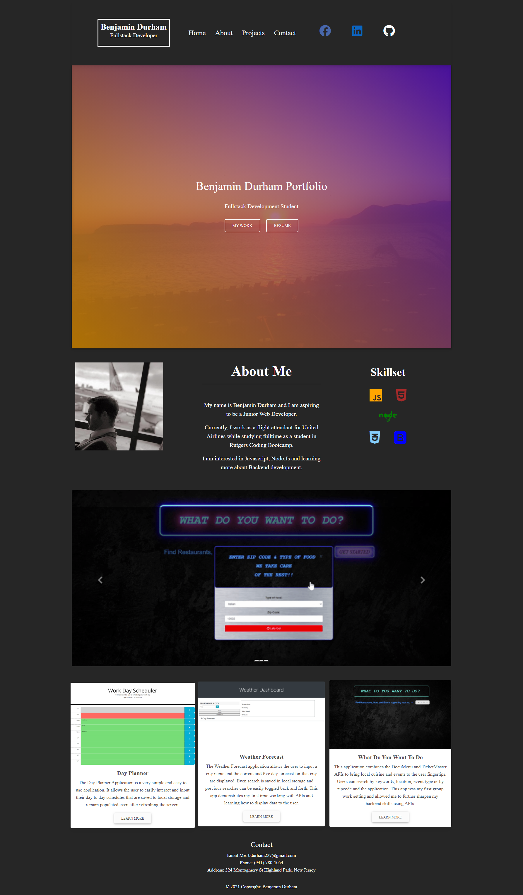

# Professional Portfolio

This is my brand new professional portfolio. The first portfolio I made was back in February 2021 with only HTML and CSS. I wanted to approach this portfolio using the new skill I have learned in Rutgers' Coding Bootcamp, namely Bootstrap. Here you will find a more polished and interactive page for the user.

1. [Description](#description)
2. [Installation](#installation)
3. [Usage](#usage)
4. [Questions](#questions)
5. [License](#license)
​
​
### Weather Dashboard-Find Current Weather and 5 Day Forecast Data!

## 1. Description
​
My motivation for this project was to rework and rebrand myself by creating a new professional portfolio using Bootstrap. This page offers the users a more enhanced visual and interactive experience. Additionally, the page is fully responsive and has various icons and buttons that will take the user to my social media pages and my resume.
​

## 2. Installation
​
[Github Pages Live Site] https://bdurham227.github.io/Current-Portfolio/

[Github Repo Site] https://github.com/bdurham227/Current-Portfolio

Live page view: 

Desktop View:
​
​

Gif demonstrating the applications functionality:

## Questions

For any questions, concerns, feedback or advice contact me via:

Email: bdurham227@gmail.com
Github: https://github.com/bdurham227

​

## License
MIT License

Copyright (c) [2021] [CurrentPortfolio]

Permission is hereby granted, free of charge, to any person obtaining a copy of this software and associated documentation files (the "Software"), to deal in the Software without restriction, including without limitation the rights to use, copy, modify, merge, publish, distribute, sublicense, and/or sell copies of the Software, and to permit persons to whom the Software is furnished to do so, subject to the following conditions:

The above copyright notice and this permission notice shall be included in all copies or substantial portions of the Software.

THE SOFTWARE IS PROVIDED "AS IS", WITHOUT WARRANTY OF ANY KIND, EXPRESS OR IMPLIED, INCLUDING BUT NOT LIMITED TO THE WARRANTIES OF MERCHANTABILITY, FITNESS FOR A PARTICULAR PURPOSE AND NONINFRINGEMENT. IN NO EVENT SHALL THE AUTHORS OR COPYRIGHT HOLDERS BE LIABLE FOR ANY CLAIM, DAMAGES OR OTHER LIABILITY, WHETHER IN AN ACTION OF CONTRACT, TORT OR OTHERWISE, ARISING FROM, OUT OF OR IN CONNECTION WITH THE SOFTWARE OR THE USE OR OTHER DEALINGS IN THE SOFTWARE

